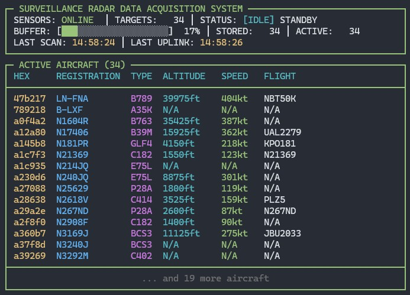

# ADSB Aircraft Logger

This project is designed to log aircraft using data from an Automatic Dependent Surveillance-Broadcast (ADS-B) receiver. It fetches aircraft data, caches it, and periodically uploads a summary to a MySQL database.

## Features

* **Data Fetching**: Reads `aircraft.json` from an ADSB web interface (like tar1090).

* **Data Enrichment**: Fetches aircraft registration and type information from an `aircraft.csv` file.

* **Database Logging**: Stores comprehensive aircraft data in a MySQL database.

* **Efficient Caching**: Caches aircraft data in memory to minimize database writes.

* **Resiliency**: Implements connection pooling, retry mechanisms, and circuit breakers for robust operation.

* **Email Notifications**: Sends email alerts on critical database failures.

* **Graceful Shutdown**: Ensures all cached data is saved upon script termination.

* **Configurable**: Settings can be managed via environment variables or direct script modification.

* **Dynamic Console UI**: Provides a real-time dashboard in the terminal to monitor script activity.

  

## Prerequisites

1. **Python 3**: Ensure you have Python 3 installed.

2. **Required Libraries**: Install the necessary Python packages using pip:

   ```bash
   pip install mysql-connector-python requests
   ```

3. **ADS-B Receiver**: An ADS-B receiver (e.g., a Raspberry Pi with an SDR and dump1090-fa/tar1090) that provides `aircraft.json` and `aircraft.csv` files via a web server.

4. **MySQL Database**: A MySQL or MariaDB database server. (remote or local)

## Setup Instructions

### 1. Database Setup

First, you need to create the database table and indexes.

1. **Create a Database**: Log in to your MySQL server and create a new database.

   ```sql
   CREATE DATABASE adsb_data;
   ```

2. **Configure `database_setup.py`**: Open the `database_setup.py` file and update the `DB_CONFIG` dictionary with your database credentials.

   ```python
   DB_CONFIG = {
       'user': 'your_db_user',
       'password': 'your_db_password',
       'host': '127.0.0.1',  # Or your database server IP/hostname
       'database': 'adsb_data'
   }
   ```

3. **Run the Setup Script**: Execute the script from your terminal. It will connect to the database and create the `tracked_aircraft` table.

   ```bash
   python database_setup.py
   ```

### 2. Logger Configuration

Next, configure the main logging script.

1. **Configure `adsb_logger.py`**: Open `adsb_logger.py` and modify the configuration sections at the top of the file.

   * **`Config` Class**: Update the default URLs for `AIRCRAFT_JSON_PATH` and `AIRCRAFT_CSV_PATH` to point to your ADS-B receiver's web interface.

     ```python
     class Config:
         def __init__(self):
             self.AIRCRAFT_JSON_PATH = os.getenv('AIRCRAFT_JSON_PATH', 'path-to/aircraft.json')
             self.AIRCRAFT_CSV_PATH = os.getenv('AIRCRAFT_CSV_PATH', 'path-to/aircraft.csv')
             # ... other settings
     ```
> [!NOTE]
> You may need to run a script in your dump1090, dump1090-fa, tar1090 installation to generate the aircraft.csv file. This file contains hex, registration, and aircraft type descriptors for known aircraft. Check their individual GitHub pages for more information.

   * **`DB_CONFIG`**: Enter the same database credentials you used in the setup script.

     ```python
     DB_CONFIG = {
         'user': 'your_db_user',
         'password': 'your_db_password',
         'host': '127.0.0.1',
         'database': 'adsb_data',
         # ... other settings
     }
     ```

   * **`EMAIL NOTIFICATION CONFIGURATION`**: (Optional) To receive email notifications on failure, update the SMTP settings. If you don't need this, you can leave the `SENDER_EMAIL` as an empty string.

     ```python
     SMTP_SERVER = 'smtp.example.com'
     SMTP_PORT = 587
     SENDER_EMAIL = 'sender@example.com'
     SENDER_PASSWORD = 'your_email_password'
     RECEIVER_EMAIL = 'receiver@example.com'
     ```

2. **Using Environment Variables (Optional)**: For better security and flexibility (e.g., in Docker), you can configure the script using environment variables instead of editing the file directly. The script will prioritize environment variables over the default values in the code.

   Example for Linux/macOS:

   ```bash
   export DB_USER="my_user"
   export DB_PASSWORD="my_password"
   export AIRCRAFT_JSON_PATH="[http://192.168.1.100/tar1090/data/aircraft.json](http://192.168.1.100/tar1090/data/aircraft.json)"
   python adsb_logger.py
   ```

## Running the Logger

Once configured, run the logger script from your terminal:

```bash
python3 adsb_logger.py
```

The script will start, and you will see a dynamic dashboard showing the current status of data collection, caching, and database uploads. To stop the script, press `Ctrl+C`. It will perform a graceful shutdown, attempting to upload any remaining cached data before exiting.
